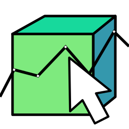
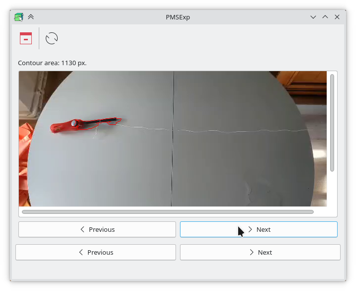

#  PMSExp

## Initialization procedure

The following steps are described in order of appearance.

### Video uploading

All main video formats are normally supported.

The video file is loaded by _drag and drop_: the file in question has to be dropped above the _Load data_ text.

### Object selection

The object to be monitored has to be selected using the keyboard and mouse as it is described in the help label.

### Contour selection

A contour has now to be selected in order to refine the previous selection.

The different computed are representing in a list and the _Previous_ and _Next_ buttons (the top ones) are used for navigating in it. Moreover, the list in question is sorted so that the first element is the most relevant (the contour area is that closest to the selection area on the previous page) and the last the least relevant.

### Calibration setting

Finally, calibration has to be defined so that the program knows what measurement, in reality, a pixel corresponds to. The unit used is the centimeter.

### Statistics

The time of processing depends of various parameters such as contour complexity and video length; however, it should not exceed more than one minute.

After data processing, three different pages are now available described, from top to bottom, in the following lines:

1. a graph showing the time evolution of the heading;
2. two vertically aligned graphs representing time evolution of the two coordinates (abscissa and ordinate);
3. a graph representing the trajectory of the monitored object.

It is important to notice that the first position is set as origin and the heading is computed from the abscissa axis.

## Toolbar

Two toolbuttons can be used whose respective function is described, from left to right, in the following lines:

1. exit the application;
2. reset loading status (all initialization procedure is lost and has to be restarted).
